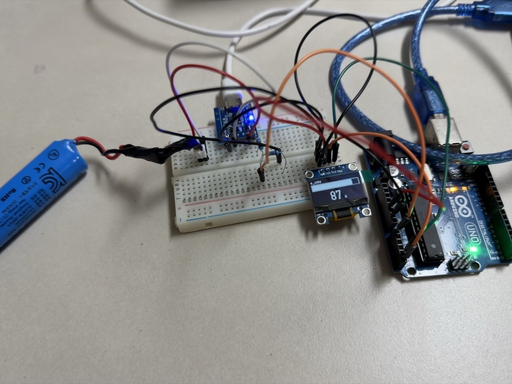

# 18650 배터리 게이지 (TP4056 + 0.96" OLED)

USB-C로 18650을 충전하면서 잔량을 OLED에 표시하는 장치.
디스플레이는 [`tzt-oled-096`](../tzt-oled-096/)에서 검증한 SSD1306 모듈을 그대로 쓴다.

**회로도: [`wiring.html`](wiring.html)** — 브라우저로 열면 된다.
모듈 핀 배치, 전체 배선, 분압 회로를 그림으로 정리했다.

```bash
open wiring.html
```

## 먼저 알아야 할 것 — 아두이노는 충전하지 않는다

```
USB-C ──> TP4056 ──> 18650          아두이노는 이 경로에 끼어들지 않는다
           (CC/CV 충전 전담)
             │
             ├── OUT+ ──> 분압 ──> A0   (전압 읽기)
             └── CHRG ───────────> D2   (충전 중 감지)
```

리튬이온 충전에는 **정전류→정전압 전환, 4.2V ±1% 정밀도의 종료 판정, 과충전·과방전·과전류 차단**이 필요하다. 이걸 아두이노 코드로 흉내내면 버그 하나가 곧 발화다. TP4056은 그 로직이 전부 들어간 전용 IC이고 1달러짜리다.

**충전은 TP4056에 맡기고 아두이노는 계기판만 한다.** 타협이 아니라 올바른 역할 분담이다.

## 안전

- **아두이노 `GND`는 반드시 `OUT-`에 문다.** 아래 "보호회로는 음극만 끊는다" 참조 — `B-`에 물면 과방전 차단이 걸려도 아두이노가 계속 셀을 소모한다
- 보호회로 있는 셀을 쓴다. "리튬이온 **보호회로 셀**"이라고 적힌 제품이면 셀 자체에 PCB가 들어 있다 (TP4056 모듈 보호회로와 이중이 되며, 이중은 문제가 아니라 바람직하다)
- 충전 중 자리를 비우지 않는다. TP4056은 1A 충전 시 칩이 뜨겁다
- 배터리 극성을 반대로 물리면 모듈이 즉시 죽는다. `B+`가 배터리 `+`
- 부풀거나 찌그러진 셀은 쓰지 않는다

## 부품

| 부품 | 비고 |
|---|---|
| Arduino UNO | |
| [TP4056 모듈 (USB-C)](https://s.click.aliexpress.com/e/_c4swYCHt) | `B+/B-/OUT+/OUT-` 4패드 = 보호회로 있는 버전 |
| 18650 셀 | 보호회로 내장 권장 |
| 0.96" SSD1306 OLED (I2C 4핀) | `tzt-oled-096`에서 쓴 것 그대로 |
| 저항 10kΩ × 2 | 분압용 — 같은 값 두 개면 된다 |

저항 두 개면 끝이다. 10세그먼트 바 그래프 방식은 핀 10개 + 전류제한 저항 10개가 필요했고, 칩 전체 전류 한계(200mA) 계산까지 해야 했다. OLED는 그 문제가 통째로 없어진다.

## 배선

### OLED (I2C)

| OLED | UNO |
|---|---|
| `GND` | GND |
| `VDD` / `VCC` | 5V |
| `SCK` / `SCL` | **A5** |
| `SDA` | **A4** |

실크 표기가 제각각이다. `VDA`로 보이면 `VDD`이고 `SCK`는 `SCL`과 같다. 자세한 건 [`tzt-oled-096/README.md`](../tzt-oled-096/README.md) 참조.

### 전압 측정

```
TP4056 OUT+ ──[ R1 10kΩ ]──┬──[ R2 10kΩ ]── GND
                           │
                           └──> A0                  <- 중간 탭. 여기를 읽는다

TP4056 OUT- ─────────────────> Arduino GND   (공통 접지 필수)
TP4056 CHRG ─────────────────> D2            (선택 — 충전 감지용)
```

### 보호회로는 음극만 끊는다

**`B+`와 `OUT+`는 기판에서 직결된 같은 노드다.** 도통 모드로 재면 바로 삐 소리가 난다.

리튬이온 보호회로(DW01 + 8205A)는 **로우사이드 스위칭** 구조여서, 차단용 MOSFET 두 개가
`B-`와 `OUT-` 사이에만 들어간다. 하이사이드(+)를 끊으려면 P채널 MOSFET이 필요한데
비싸고 저항이 커서, 거의 모든 배터리 보호회로가 이 구조를 쓴다.

```
셀 +  ●───────────────────●  B+ ═══ OUT+     <- 그냥 연결
셀 −  ●───● B− ─[8205A]─● OUT−               <- 여기서만 끊는다
                 ↑
              DW01 제어
```

그래서 `+`는 어디서 따도 같고, **실질적인 차이는 접지 기준점에 있다.**

| 아두이노 `GND` 연결 | 과방전 차단이 걸렸을 때 |
|---|---|
| `OUT-` | 회로가 함께 끊김 — 셀이 더 이상 방전되지 않는다 |
| `B-` | 보호회로 우회 — 아두이노가 계속 배터리를 소모한다 |

과방전 차단은 셀이 2.5V 부근까지 떨어졌을 때 걸린다. `B-`에 물어두면 차단 후에도
아두이노 소비가 멈추지 않아, 며칠 방치하면 셀이 영구 손상된다.

**확인법**: `B+`↔`OUT+`는 도통(삐), `B-`↔`OUT-`는 사이에 MOSFET이 있어 반응이 다르다.
그 차이가 보호회로가 살아 있다는 증거다.

### 분압이 어떻게 동작하나

**"배터리 +와 −가 저항을 통해 연결되는 것 아닌가?"** — 맞다. 그리고 **그게 의도한 바다.**
전류가 흘러야 전압이 나뉜다.

전압을 "나눈다"는 건 전류가 저항을 지나며 전압을 떨어뜨린다는 뜻이다(`V = I × R`).
직렬이라 두 저항에 **같은 전류**가 흐르고, 저항값이 같으면 강하도 같다.

```
OUT+ 4.09V
  │
[R1 10k]   ← 2.05V 강하
  │
  ├──> A0   여기가 2.05V (GND 기준)
  │
[R2 10k]   ← 2.05V 강하
  │
GND 0V

흐르는 전류 = 4.09V ÷ 20kΩ = 205µA
```

**전류가 안 흐르면 측정할 것도 없다.** `R2`에서 GND로 가는 선을 빼면 전류 경로가 끊기고,
`R1`에 강하가 생기지 않아 A0에는 4.09V가 그대로 나타난다. 분압이 아예 성립하지 않는다.

### A0 쪽으로는 전류가 안 흐른다

이 구분이 중요하다. 회로에 경로가 둘 있는 것처럼 보이지만 실제로는 하나다.

| 경로 | 전류 |
|---|---|
| `OUT+` → R1 → R2 → `GND` | **205µA** — 이게 분압을 만든다 |
| 중간 탭 → `A0` | **거의 0** — ADC 입력 임피던스가 100MΩ 이상 |

A0는 중간 지점의 전압을 **구경만 한다.** 전류를 빼가지 않으므로 분압비가 흐트러지지 않는다.
(반대로 임피던스가 낮은 것을 중간 탭에 물리면 분압이 무너진다)

### 205µA는 문제가 되나

되지 않는다. 2950mAh 셀 기준 **1.6년치**이고, 아두이노 자체 소비(약 50mA)의 0.4%다.
저항 없이 `OUT+`와 `GND`를 직결하면 그게 단락이지만, 20kΩ이 전류를 이 수준으로 묶어둔다.

### 그런데 왜 굳이 나누나

18650 만충 4.2V는 5V ADC 범위 안이라 **직결도 가능하다.** 이 프로젝트에서 분압을 쓰는
이유는 정밀도가 아니라 **안전**이다.

- 아두이노가 꺼진 상태에서 A0에 4.2V가 걸리면 내부 보호 다이오드로 역전류가 흐른다
- 12V·24V처럼 ADC 범위를 넘는 전압을 읽을 때는 분압이 **필수**다. 이 회로는 그 기본형이다

```
OUT+ ──[ R1 10k ]──┬──[ R2 10k ]── GND
                   │
                   └──→ A0
```

브레드보드에서는 **가운데 열에 세 개가 모이는 것**이 핵심이다 (열 번호는 예시).

| 열 | 꽂는 것 |
|---|---|
| `15` | `OUT+` 점퍼 · R1 한쪽 다리 |
| `20` | R1 반대쪽 · R2 한쪽 · **`A0` 점퍼** |
| `25` | R2 반대쪽 · `GND` 점퍼 |

### 왜 100k가 아니라 10k인가

| | `10k` + `10k` | `100k` + `100k` |
|---|---|---|
| 분압비 | 2:1 | 2:1 (동일) |
| ADC 소스 임피던스 | **5kΩ** — 권장 범위 안 | 50kΩ — 권장 초과 |
| 배터리 누설 | 210µA (1.6년치) | 21µA (16년치) |

ATmega328P 데이터시트는 아날로그 소스 임피던스를 **10kΩ 이하**로 권장한다.
`100k+100k`의 등가 출력 임피던스는 50kΩ이라 권장치를 넘고, ADC 입력 누설 전류
(최대 ±1µA)가 만드는 오차가 커진다. `10k+10k`는 등가 5kΩ으로 범위 안이다.

누설이 10배로 늘지만 아두이노 자체 소비(약 50mA)의 0.4% 수준이라 실질적 영향이 없다.
`100k`가 나은 경우는 **배터리로 아두이노까지 구동하며 몇 달 방치하는 저전력 장치**뿐이다.

**CHRG 핀**은 충전 중 LOW로 당겨지는 오픈 드레인 출력이다. 연결하지 않아도 게이지는 동작한다(항상 "미충전"으로 읽힐 뿐).

## 화면

```
 3.85V              CHRG      <- 전압(좌) / 충전상태(우)
+------------------------+
|##############          |    <- 잔량 바
+------------------------+
          62 %                <- 큰 숫자
```

| 상태 | 표시 |
|---|---|
| 평상시 | 잔량만큼 바 채움 + 퍼센트 |
| 충전 중 | 우상단 `CHRG`, 바의 빈 공간에 블록이 흐름 |
| 만충 | 우상단 `FULL` |
| 잔량 10% 이하 | 채운 부분이 깜빡임 |

## 사용 순서

### 1. 캘리브레이션

```bash
arduino-cli compile -b arduino:avr:uno -u -p /dev/cu.usbmodem1301 01_voltage_monitor
arduino-cli monitor -p /dev/cu.usbmodem1301 -c baudrate=9600
```

멀티미터로 `OUT+`/`OUT-` 실제 전압을 재서 시리얼의 `battery` 값과 비교한다.

```
보정값 = 현재 DIVIDER_RATIO × (멀티미터 전압 / 시리얼 전압)
```

두 값이 0.02V 이내로 맞으면 그 숫자를 `02_battery_gauge`의 `DIVIDER_RATIO`에 옮겨 적는다.

**AVCC를 5.0V로 가정하지 않는다.** USB 전압은 4.7~5.1V로 흔들리고 그게 그대로 측정 오차가 된다. 스케치는 ATmega328P 내부 1.1V 밴드갭으로 실제 AVCC를 역산해서 쓴다(`readVccMilliVolts()`).

### 2. 게이지 실행

```bash
arduino-cli compile -b arduino:avr:uno -u -p /dev/cu.usbmodem1301 02_battery_gauge
```

## 스케치

| 스케치 | 내용 | Flash | 전역 RAM |
|---|---|---|---|
| `01_voltage_monitor` | 전압 측정 + 시리얼 출력 (캘리브레이션용) | 4,508B (13%) | 200B (9%) |
| `02_battery_gauge` | OLED 게이지 본편 | 16,950B (52%) | 893B (43%) |

### U8g2를 쓴 이유

`Adafruit_SSD1306`은 `begin()` 안에서 **1024바이트** 프레임버퍼를 `malloc`한다. 이 스케치는 이동평균 버퍼와 ADC 코드까지 얹기 때문에 UNO(SRAM 2KB)에서 여유가 빠듯해진다.

U8g2의 `_1_` 페이지 버퍼 생성자는 약 128바이트만 쓰고 **힙 할당이 없다.** 위 표의 893B가 실사용량 전부다. Adafruit였다면 리포트에 안 잡히는 1KB가 힙에 추가로 붙는다. (자세한 건 [`tzt-oled-096/README.md`](../tzt-oled-096/README.md)의 "RAM 함정")

대신 페이지 모드에는 제약이 있다 — `firstPage()/nextPage()` 블록이 **8번 반복 실행**되므로 그 안에 측정이나 카운터 증가를 넣으면 안 된다. 이 스케치는 그리기 함수를 `drawScreen(값들...)` 형태로 분리해서, 인자로 받은 값만 쓰고 내부에서 상태를 바꾸지 않도록 했다.

## 이 프로젝트의 진짜 어려운 부분 — 전압으로는 잔량을 정확히 못 맞춘다

리튬이온 방전 곡선은 **중간이 평탄하다.**

```
4.2V ┤▔▔╲                         100%
3.8V ┤    ╲▁▁▁▁▁▁▁▁▁▁▁▁▁          80% ~ 20%   ← 여기가 거의 평평
3.4V ┤                 ╲          20%
3.0V ┤                  ╲▁        0%
```

3.7V 부근에서 **±0.05V만 흔들려도 잔량이 20%씩 튄다.** 부하가 걸리면 내부 저항 때문에 전압이 더 내려가 실제보다 적게 보이기도 한다.

그래서 이 스케치는 두 가지로 대응한다:

1. **선형 변환을 쓰지 않는다.** `3.0V=0% / 4.2V=100%`로 단순 매핑하면 "80%에서 한참 머물다 갑자기 훅 떨어지는" 게이지가 된다. 실측 방전 곡선을 21점 룩업 테이블(`SOC_TABLE`)로 넣고 그 사이를 보간한다
2. **이동평균 8회**로 떨림을 잡는다. ADC도 16회 평균

그래도 **어디까지나 추정이다.** 휴대폰 배터리 %가 부정확한 것도 같은 이유다.
더 정확하게 하려면 전용 fuel gauge IC를 쓰는데, 방식이 두 갈래다.

| 방식 | 예 | 특징 |
|---|---|---|
| **ModelGauge** (전압 + 배터리 모델) | MAX17048 | **센스 저항 불필요**, 배선 간단. 단순 전압 추정보다 훨씬 정확하되 전류를 재지는 않는다 |
| **쿨롱 카운팅** (전류 적산) | BQ27441 | 센스 저항 필요. 원리상 가장 정확하나 장시간 누적 드리프트가 생겨 주기적 학습이 필요하다 |

이 프로젝트가 하는 건 둘 다 아닌 **맨 전압 추정**이라 가장 거칠다.

## 충전 상태를 MCU로 읽는 것의 한계 (이 모듈 기준)

TP4056 칩에는 상태 출력이 두 개 있고, 둘을 다 읽으면 세 상태를 구분할 수 있다.

| `CHRG` (pin 7) | `STDBY` (pin 6) | 상태 |
|---|---|---|
| LOW | HIGH | 충전 중 |
| HIGH | LOW | 충전 완료 |
| HIGH | HIGH | USB 미연결 / 배터리 없음 |

**문제는 이 모듈이 두 핀을 패드로 빼놓지 않았다는 것이다.** 앞뒤를 확인한 결과
큰 스루홀 4개는 전부 `OUT+`/`B+`/`B-`/`OUT-` 이고, 상태 핀은 LED에만 연결돼 있다.
그래서 이 모듈로는 아래 둘 중 하나를 감수해야 한다.

**① LED 캐소드에 납땜한다.** 회로가 `VCC ──[저항]──▷|── 칩 핀` 이라 LED의 한쪽 다리가
곧 상태 출력이다. 충전 중(LED 켜짐)에 LED 양단을 재서 **0V 근처인 쪽**이 칩 핀이다.
SMD 패드가 작아 인두 끝이 가늘어야 한다.

**② 전압 추세로 추론한다.** 5~10분 간격 스냅샷과 비교해 상승이면 충전 중으로 본다.
배선이 필요 없지만 **하필 완충 근처(CV 단계)에서 전압이 거의 안 올라 가장 부정확하다.**
정작 알고 싶은 "충전 중 → 완료" 전환을 잡기 어렵다.

**현재 스케치는 `CHRG` 만 읽도록 짜여 있고, 그마저 연결하지 않으면 항상 `no` 로 나온다.**
화면의 `FULL` 은 `soc >= 99` 라는 전압 기반 추정이라, 실제로 충전이 끝나도
잔량이 99% 미만이면 뜨지 않는다(이 검증에서도 87%라 표시되지 않았다).

### 다시 고른다면 — 모듈 선택지

| 목적 | 선택 | 비고 |
|---|---|---|
| **충전 상태만 읽으면 됨** | `CHRG`/`STDBY` 패드가 노출된 TP4056 보드 | 같은 칩, 보드만 다름. 가장 저렴하고 코드 변경 최소 |
| **잔량 정확도까지** | 기존 TP4056 + **MAX17048** I2C 게이지 | ModelGauge라 센스 저항 불필요. OLED와 I2C 버스 공유 |
| **한 번에 해결** | SparkFun Battery Babysitter (BQ24075 + BQ27441) | 충전·게이지 통합, I2C. 대신 비싸다 |
| **파워뱅크 기능까지** | IP5306 (I2C 버전) | 충전 + 5V 부스트 + 잔량. 잔량이 25% 단위로 거칠다 |

⚠️ **UNO(5V 로직)와 3.3V I2C 장치의 조합에 주의.** MAX17048 같은 게이지는 배터리에서
직접 전원을 받아 I2C가 3.3V 레벨이다. UNO에 직결하면 아웃 오브 스펙이라 레벨 시프터가
필요하고, **애초에 ESP32처럼 3.3V 로직 보드로 옮기는 편이 깔끔하다.**

구매 전 확인할 것 — **상품 사진에서 `CHRG`/`STDBY` 글자가 찍힌 패드가 실제로 보이는지.**
"TP4056 모듈"이라는 이름은 같아도 보드 레이아웃이 제각각이다.

## 충전 전류 조정 (선택)

TP4056의 충전 전류는 `PROG` 핀의 저항(`R_prog`)으로 정해진다. 모듈에는 보통 1.2kΩ(=1A)이 붙어 있다.

| R_prog | 충전 전류 |
|---|---|
| 1.2kΩ | 1000mA (기본) |
| 2kΩ | 580mA |
| 3kΩ | 400mA |
| 5kΩ | 250mA |
| 10kΩ | 130mA |

2950mAh 셀을 1A로 충전하면 약 0.34C로 무난하고 3시간 반쯤 걸린다. 발열이 신경 쓰이거나 셀 수명을 늘리고 싶으면 저항을 키워 전류를 낮춘다.

## 트러블슈팅

1. **화면이 안 켜짐** → I2C 주소. `tzt-oled-096/01_i2c_scanner`를 돌려 `0x3C`인지 확인한다. `0x3D`면 스케치의 `setI2CAddress` 주석을 푼다 (U8g2는 8비트 주소라 `0x3D * 2`)
2. **전압이 0V로 읽힘** → 공통 접지 확인. TP4056 `OUT-`와 아두이노 `GND`가 연결돼 있어야 한다
3. **전압이 실제의 절반** → `DIVIDER_RATIO`가 1.0으로 남아 있다. 2.0 부근이어야 한다
4. **퍼센트가 계속 출렁임** → `SMOOTH_WINDOW`를 8에서 16으로 키운다. 반응은 느려지지만 안정된다
5. **충전 감지가 안 됨** → CHRG 패드는 오픈 드레인이라 풀업이 필요하다. 스케치는 `INPUT_PULLUP`을 쓰므로 배선만 확인하면 된다
6. **화면이 깜빡이거나 느림** → 페이지 모드는 8번 나눠 그린다. `drawScreen()` 안에서 무거운 연산(float 계산 등)을 하면 8배로 느려진다

## 실기 검증 (2026-08-15)

Arduino UNO + TP4056(USB-C, 4패드) + 18650 보호회로 셀 + 0.96" SSD1306 실물.



| 항목 | 실측값 |
|------|--------|
| 포트 | `/dev/cu.usbmodem1301` |
| 아두이노 AVCC | **5150 mV** (멀티미터) |
| 배터리 전압 | **4090 ~ 4100 mV** (멀티미터) |
| 게이지 표시 | **4088 ~ 4103 mV / 87%** |
| 이동평균 후 편차 | 15mV 이내 |
| 밴드갭 상수 | `1096950` (이론값 `1125300` 에서 보정) |
| 분압비 | `1.985` (이론값 `2.000` 에서 보정) |

두 스케치 모두 컴파일·업로드·동작 확인 완료 (4,508B / 16,736B).

### 캘리브레이션은 두 단계였다

오차원이 두 개라, 하나만 고치면 오히려 어긋나 보인다.

| 단계 | 표시값 | 무엇을 고쳤나 |
|------|--------|--------------|
| 초기 | 4224mV / 100% | — (두 오차가 우연히 상쇄돼 맞아 보였다) |
| AVCC 보정 후 | 4125mV / 91% | 밴드갭 상수 |
| **최종** | **4095mV / 87%** | 분압비까지 |

**처음에 100%가 뜬 건 운이었다.** 밴드갭이 전압을 높게 계산하고 분압비가 낮게 계산해서
결과가 우연히 맞았을 뿐이다. 한쪽만 보정하니 다른 쪽 오차가 드러났다.

**1단계 — 밴드갭 개체차.** `readVccMilliVolts()`가 AVCC를 5283mV로 추정했는데 멀티미터
실측은 5150mV였다(2.6% 과대추정). 데이터시트상 1.1V인 내부 기준이 이 개체에서는
1.16V쯤인 것이다. ±10% 편차는 정상 범위다.

```cpp
새 상수 = 실측mV × (1125300 ÷ 이론추정mV) = 5150 × 213 = 1096950
```

**2단계 — 분압비.** 10k 저항 두 개의 실제 값이 정확히 같지 않다(±5% 오차).
게이지가 4125mV를 표시할 때 멀티미터는 4095mV였다.

```cpp
새 분압비 = 2.000 × (4095 ÷ 4125) = 1.985
```

두 값 모두 **이 보드·이 저항 조합에 특화된 값**이다. 부품을 바꾸면 다시 맞춰야 한다.

### 기준으로 쓴 멀티미터는 믿을 만한가

절대 기준은 아니다. 저가 수동 레인지 제품의 DC 전압 정확도는 보통
**±(0.5% + 2digit)** 로, 4.09V 측정 시 약 ±0.04V가 실린다.

다만 계측의 위계는 분명하다.

| 기준 | 오차 |
|---|---|
| ATmega328P 내부 밴드갭 | **±10%** |
| 저가 멀티미터 | ±0.5% + 2digit |
| 교정된 계측기 | ±0.05% 이하 |

**밴드갭보다 20배쯤 나은 기준**이라 크로스체크로서 의미가 있다.

**멀티미터를 검증하는 법**: 아두이노 `3.3V` 핀을 잰다. 온보드 LDO 출력이라 USB 전압과
무관하게 안정적이고 보통 ±2% 안에 든다. 이 보드에서는 **3.32V**로 나와(편차 0.6%)
측정값을 신뢰할 수 있었다. `3.15V`나 `3.45V`처럼 벗어나면 멀티미터 쪽을 의심한다.

### 상태 LED — 데이터시트가 정하는 것은 핀 기능뿐, 색이 아니다

[TP4056 데이터시트](https://evelta.com/content/datasheets/482-TP4056.pdf)가 정의하는 건
두 개의 **오픈 드레인 상태 출력**이다.

| 핀 | 이름 | LOW가 되는 때 |
|---|---|---|
| 6 | `STDBY` | **충전 종료**(termination) 시 |
| 7 | `CHRG` | **충전 중**일 때 |

평상시에는 하이 임피던스라 외부 풀업(보통 10kΩ)이 필요하다. 모듈에서는 각 핀에 LED가
달려 있어, LOW로 당겨질 때 불이 켜진다.

**어느 핀에 무슨 색 LED를 다는지는 데이터시트에 없다.** 모듈 제조사가 정한다.
관례적으로 빨강 = `CHRG`(충전 중), 파랑·초록 = `STDBY`(완료)를 쓰지만 보장은 없다.

**확실하게 확인하는 방법 두 가지**:
- `CHRG` 패드를 `D2`에 연결했다면 시리얼 출력의 `charging` 열을 본다 (`YES`/`no`)
- 방전된 셀을 꽂아 충전을 시작시켜 어느 색이 켜지는지 본다

### 충전 완료가 4.2V를 뜻하지 않았다

이 검증에서 가정 하나가 실측에 뒤집혔다.

파란 LED가 충전 완료(`STDBY`)로 보였으므로 배터리가 4.2V일 것으로 보고, **그걸 기준 삼아
분압비를 맞추려 했다.** 그런데 멀티미터로 재보니 `OUT+`/`OUT-` 가 **4.09~4.10V** 였다.

TP4056 데이터시트의 종료 전압 정밀도는 4.2V ±1.5%(= 4.137V 이상)인데 그마저 벗어난다.
저가 모듈에서 드물지 않은 일이다. 원인은 두 가지 중 하나로 보인다.

- 이 모듈이 4.2V까지 올리지 않고 끊는다
- 충전 완료 후 표면 전하가 빠지며 자연 하강했다 (TP4056은 4.05V 이하로 떨어져야 재충전)

**교훈**: 충전 IC의 상태 표시를 전압 기준으로 삼지 않는다. 그 방법으로 보정했다면
게이지가 계속 2.5% 높게 표시했을 것이다. 독립된 측정 도구가 그 오류를 잡았다.

그래서 만충 직후인데도 게이지는 87%를 가리킨다. **게이지가 틀린 게 아니라
배터리가 실제로 4.09V인 것**이고, 그 값이 방전 곡선에서 85~90% 구간이다.

### ⚠️ 멀티미터로 아두이노 핀을 직접 짚지 말 것

이 검증 중에 실제로 겪은 일이다. 다이얼을 DC `20V`에 제대로 맞췄는데도
프로브를 `5V` 핀에 대는 순간 `0.15V`가 찍히고 **아두이노 전원이 나갔다.**

전압계는 내부 저항이 10MΩ이라 그 자체로는 단락을 만들지 않는다. 원인은
**UNO 전원 헤더에서 `5V`와 `GND`가 바로 옆에 붙어 있어** 프로브 팁이 두 핀에 동시에
닿은 것이다. 전압이 무너지며 0.15V가 찍히고 USB 폴리퓨즈가 끊었다.

```
IOREF  RESET  3.3V  [5V]  [GND]  GND  VIN
                      ↑     ↑
                    프로브가 스치기 쉽다
```

USB를 뽑고 1분 뒤 다시 꽂으니 정상 복구됐다(폴리퓨즈는 자동 복구형). 스케치도 무사했다.

**측정은 브레드보드의 빈 구멍에서 한다.** 구멍이 프로브를 잡아주고 열끼리 떨어져 있다.
프로브 팁이 굵으면 점퍼선을 꽂고 그 끝에 물린다.
