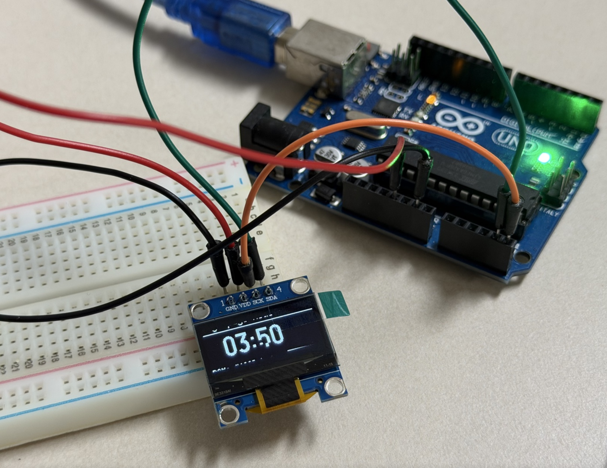

# TZT 0.96" OLED (SSD1306, I2C) — Arduino 예제 모음

TZT 0.96인치 4핀 OLED 모듈(SSD1306, 128x64, I2C)을 Arduino Uno/Nano(AVR)에 붙이는 예제.

## 실기 검증 (2026-08-15)



*`04_u8g2_bigfont` 동작 중. 큰 숫자 `03:50`과 하단 `RAM: ~128B buffer` / 진행 바.
모듈 실크는 `1 GND / 2 VDD / 3 SCK / 4 SDA`.*

정품 Arduino UNO + TZT 4핀 OLED 실물로 확인한 값. 이 환경에서는 아래를 그대로 쓰면 된다.

| 항목 | 실측값 |
|------|--------|
| 보드 | Arduino UNO (ATmega328P, signature `1E 95 0F`) |
| 포트 | `/dev/cu.usbmodem1301` |
| FQBN | `arduino:avr:uno` (`board list`가 자동 인식) |
| I2C 주소 | **`0x3C`** — 스케치 기본값과 일치, 수정 불필요 |
| 모듈 실크 | `1 GND` / `2 VDD` / `3 SCK`(=SCL) / `4 SDA` |
| 전원 | 5V |

검증 결과:

- `01_i2c_scanner` — `I2C device found at address 0x3C` 출력 확인
- `02_hello_oled` — 화면 출력 확인 (uptime counter 동작), `SSD1306 init failed` 미출력 = `begin()` 성공
- `03_graphics_demo` / `04_u8g2_bigfont` — 업로드 성공 (16,332B / 14,834B 기록)

네 스케치 모두 `arduino:avr:uno` 컴파일 통과.

## 모듈 사양

| 항목 | 값 |
|------|-----|
| 컨트롤러 | SSD1306 |
| 해상도 | 128 x 64 (0.96인치 기준) |
| 인터페이스 | I2C (4핀: VCC / GND / SCL / SDA) |
| I2C 주소 | 보통 `0x3C`, 일부 모듈 `0x3D` |
| 구동 전압 | 모듈 보드는 3.3~5V (온보드 레귤레이터 있음) |
| 색상 | 단색 (흰색/파란색/노랑+파랑 2색 분할) |

> 2색(노랑/파랑) 모듈은 별도 컨트롤러가 아니라 **패널 상단 16줄만 노란색으로 인쇄된 것**이다.
> 코드에서 색을 고를 수 없고, y좌표 0~15에 그리면 노랗게 나올 뿐이다.

## 배선

| OLED (실크 표기 변형) | Uno | Nano | Mega 2560 |
|------|-----|------|-----------|
| `VCC` / `VDD` | 5V | 5V | 5V |
| `GND` | GND | GND | GND |
| `SCL` / `SCK` | A5 | A5 | 21 |
| `SDA` | A4 | A4 | 20 |

Uno/Nano의 I2C는 A4/A5 고정이다. 다른 핀으로는 못 옮긴다(소프트웨어 I2C 제외).

### 실크 인쇄가 표와 다를 때

같은 SSD1306 I2C 모듈인데도 제조사마다 표기와 핀 순서가 다르다. **위치로 외우지 말고 이름을 읽고 꽂을 것.**

- **핀 순서**: `GND-VDD-SCK-SDA`와 `VCC-GND-SCL-SDA`가 모두 유통된다. GND가 첫 핀인 물건도, VCC가 첫 핀인 물건도 있다
- **`VDD` = `VCC`** — 둘 다 로직 전원. (SSD1306 데이터시트상 VDD=로직, VCC=패널 고전압이지만 4핀 모듈은 로직 전원 하나만 뽑아둔다)
- **`SCK` = `SCL`** — SCK는 원래 SPI 용어지만 I2C 모듈에도 자주 인쇄된다. **핀이 4개면 I2C 확정**이다 (SPI 버전은 최소 7핀)
- **`VDA`처럼 보이면 `VDD`다.** 실크가 작아 D 두 개가 붙어 보인다. 이 프로젝트에서도 눈으로는 `VDA`로 읽었는데 접사 사진에서 `VDD`로 확인됐다. SSD1306 모듈에 VDA라는 핀은 없다

### 5V vs 3.3V

대부분의 4핀 모듈은 온보드 레귤레이터가 있어 Uno의 5V로 구동한다.
**모듈 뒷면에 SOT-23 부품(`662K`, `AMS1117` 등 마킹)이 있으면** 5V로 연결하면 된다.

레귤레이터가 없는 3.3V 전용 모듈이라면, VDD만 3.3V로 낮추고 SCK/SDA에는 5V 신호를
그대로 주는 조합을 피한다 — 전원보다 높은 전압이 신호핀에 걸린다.
레벨 시프터를 쓰거나 3.3V 로직 보드(ESP32 등)로 옮기는 쪽이 안전하다.

## 사전 준비

```bash
# 코어 (이미 있으면 생략)
arduino-cli core install arduino:avr

# 라이브러리
arduino-cli lib install "Adafruit SSD1306"   # Adafruit GFX, BusIO 자동 설치
arduino-cli lib install "U8g2"
```

## 예제

| 스케치 | 내용 | Flash | 전역 RAM |
|--------|------|-------|----------|
| `01_i2c_scanner` | I2C 주소 확인. **가장 먼저 실행** | 4,052B (12%) | 404B (19%) |
| `02_hello_oled` | Adafruit_SSD1306 텍스트/크기/반전/카운터 | 14,758B (45%) | 527B (25%) † |
| `03_graphics_demo` | 선·도형·비트맵·바운싱 볼·하드웨어 스크롤 | 16,332B (50%) | 523B (25%) † |
| `04_u8g2_bigfont` | U8g2 페이지 버퍼 모드 + 큰 숫자 폰트 | 14,834B (45%) | 704B (34%) |

† 아래 "RAM 함정" 참조 — 이 수치에 프레임버퍼 1KB가 빠져 있다.

### 빌드 / 업로드

```bash
cd tzt-oled-096

# 포트 확인 (UNO는 FQBN까지 자동 인식된다)
arduino-cli board list

# 컴파일 + 업로드를 한 번에 (-u 가 업로드)
arduino-cli compile -b arduino:avr:uno -u -p /dev/cu.usbmodem1301 02_hello_oled

# 컴파일만
arduino-cli compile -b arduino:avr:uno 02_hello_oled

# 시리얼 모니터 (01_i2c_scanner 결과 확인용). Ctrl+C로 종료
arduino-cli monitor -p /dev/cu.usbmodem1301 -c baudrate=9600
```

포트 번호는 USB 포트를 바꿔 꽂으면 달라진다(`usbmodem1301` → `usbmodem1401` 등).
안 되면 `board list`부터 다시 확인할 것.

**모니터를 켜둔 채로는 업로드가 실패한다.** 시리얼 포트는 한 프로세스만 점유할 수 있다.
업로드 전에 `Ctrl+C`로 모니터를 반드시 끈다.

업로드가 됐는지 의심스러우면 `-v`를 붙인다. `Device signature = 1E 95 0F`와
`N bytes of flash written`이 보이면 성공이다:

```bash
arduino-cli upload -v -b arduino:avr:uno -p /dev/cu.usbmodem1301 01_i2c_scanner
```

Nano는 부트로더 세대에 따라 FQBN이 갈린다. 업로드가 `avrdude: stk500_recv()` 에러로
실패하면 구형 부트로더다:

```bash
arduino-cli upload -b arduino:avr:nano:cpu=atmega328old -p /dev/cu.usbmodem1301 02_hello_oled
```

## 두 라이브러리 중 뭘 쓸까

| | Adafruit_SSD1306 | U8g2 (`_1_` 페이지 모드) |
|---|---|---|
| 버퍼 | 전체 1KB, `begin()`에서 malloc | 약 128B, 정적 |
| 그리기 | 아무 때나 그리고 `display()` 한 번 | `firstPage()/nextPage()` 루프 필수 |
| 폰트 | GFX 기본 + 커스텀 | 내장 폰트 수백 종 (큰 숫자 폰트 포함) |
| 적합 | ESP32 등 RAM 여유 있을 때, 코드 단순 | Uno에서 다른 라이브러리와 병행할 때 |

## 실전 함정

### 1. RAM 함정 — 컴파일 리포트를 믿으면 안 된다

`Adafruit_SSD1306`은 128*64/8 = **1024바이트** 프레임버퍼를 `begin()` 안에서
`malloc`으로 잡는다 (`Adafruit_SSD1306.cpp:499`). 동적 할당이라 컴파일 결과의
"전역 변수" 통계에 **나타나지 않는다.**

- `02_hello_oled` 리포트: 전역 527B, 여유 1521B → 넉넉해 보임
- 실제: 힙에서 1024B 추가 → 스택 포함 여유는 500B 수준

컴파일은 멀쩡히 되는데 실행하면 화면이 안 켜지거나 랜덤 리셋이 나면 이 malloc이
실패한 것이다. Uno에서 센서 라이브러리 몇 개를 같이 쓰면 실제로 걸린다.
→ `04_u8g2_bigfont`의 페이지 버퍼 모드로 옮긴다.

### 2. 주소가 0x3C가 아닐 수 있다

같은 TZT 모듈이어도 기판 뒷면 저항 위치에 따라 `0x3D`인 물건이 섞여 나온다.
`01_i2c_scanner`를 먼저 돌려서 확인할 것. 라이브러리별로 표기법이 다르다:

```cpp
display.begin(SSD1306_SWITCHCAPVCC, 0x3C);  // Adafruit: 7비트 주소 그대로
u8g2.setI2CAddress(0x3D * 2);               // U8g2: 8비트 주소라 2를 곱한다
```

U8g2는 주소를 8비트로 저장했다가 전송 시점에 `>>1` 한다
(`U8x8lib.cpp:1369` — `Wire.beginTransmission(u8x8_GetI2CAddress(u8x8)>>1)`).
그래서 스캐너가 알려준 7비트 주소에 2를 곱해 넣어야 한다.
`0x3C`짜리 모듈은 U8g2 기본값이라 설정할 필요가 없다.

### 3. `SSD1306_SWITCHCAPVCC`를 빼먹으면 화면이 안 켜진다

TZT 모듈은 외부 고전압 전원이 없고 SSD1306 내부 charge pump로 패널을 구동한다.
`begin()` 첫 인자에 따라 charge pump 명령(0x8D)의 인자가 갈린다
(`Adafruit_SSD1306.cpp:582` — `EXTERNALVCC`면 `0x10`=disable, 아니면 `0x14`=enable).
`SSD1306_EXTERNALVCC`로 두면 I2C 통신은 멀쩡한데 화면만 까맣게 남는다.
대비도 같이 낮아진다(`:598-604`). 디버깅하기 짜증나는 증상이라 기억해둘 것.

### 4. `display()`를 안 부르면 아무 일도 안 일어난다

Adafruit 계열의 그리기 함수는 전부 RAM 버퍼만 건드린다.
`display()`가 실제 I2C 전송이다. 반대로 매 도형마다 `display()`를 부르면
128x64 전체를 매번 전송하느라 눈에 띄게 느려진다. 한 프레임 다 그리고 한 번만.

### 5. 페이지 모드 안에 부작용을 넣지 말 것

U8g2 `firstPage()/nextPage()` 블록은 페이지 수만큼(1페이지 모드에서 8회) **반복 실행**된다.

```cpp
// 잘못된 코드 — counter가 프레임당 8씩 증가한다
u8g2.firstPage();
do {
  counter++;
  u8g2.drawStr(0, 20, buf);
} while (u8g2.nextPage());
```

그릴 값은 루프 진입 전에 확정한다. `04_u8g2_bigfont`가 그 형태로 짜여 있다.

### 6. 화면 잔상(번인)

OLED는 정지 화면을 오래 띄우면 번인이 생긴다. 상시 구동 프로젝트라면
주기적으로 `display.clearDisplay()` 후 위치를 몇 픽셀 옮기거나,
`display.ssd1306_command(SSD1306_DISPLAYOFF)`로 끄는 구간을 둔다.

## 트러블슈팅 순서

1. **`01_i2c_scanner`에서 아무 장치도 안 나옴** → 배선/전원 문제. SDA/SCL이 바뀌었는지, VCC/GND 순서가 맞는지 확인한다. 위 "실크 인쇄가 표와 다를 때" 참조 — 핀 순서가 모듈마다 다르므로 위치가 아니라 이름을 읽고 꽂을 것
2. **주소는 잡히는데 화면이 까맘** → `SSD1306_SWITCHCAPVCC` 확인, 주소 상수 확인
3. **컴파일은 되는데 실행 중 리셋** → RAM 함정. U8g2 페이지 모드로 전환
4. **화면이 깨지거나 일부만 나옴** → I2C 풀업/전선 길이 문제. 점퍼선을 20cm 이하로 줄이고 `Wire.setClock(100000)`으로 속도를 낮춰본다

### 스크립트에서 시리얼을 캡처할 때 (실제로 걸렸던 함정)

`arduino-cli monitor`는 대화형 도구라 **백그라운드로 리다이렉트하면 stdin이 없어 즉시 종료된다.**
에러도 안 남기고 출력 파일이 0바이트로 끝나서, 보드가 죽은 것처럼 보인다.
실제로 이번에 이걸로 "업로드가 안 됐나" 하고 한참 헤맸는데 업로드는 멀쩡했다.

```bash
# 안 된다 — 로그가 0바이트로 끝난다
arduino-cli monitor -p /dev/cu.usbmodem1301 -c baudrate=9600 > out.log &
```

자동화/스크립트에서는 시리얼 장치를 직접 읽는다. `stty`로 보드레이트를 먼저 잡아야 한다:

```bash
stty -f /dev/cu.usbmodem1301 9600 raw -echo
head -c 220 /dev/cu.usbmodem1301        # 220바이트 받으면 자동 종료
```

`cu.*` 장치는 열리는 순간 DTR이 토글되며 **보드가 리셋된다.** 스케치가 처음부터 다시 도니
초기 출력을 놓치지 않는 장점이 있지만, 첫 줄이 잘려 나오기도 한다(위 실행에서도 `Ing...`처럼
중간부터 잡혔다). 사람이 직접 볼 때는 그냥 `arduino-cli monitor`를 쓰는 게 낫다.
